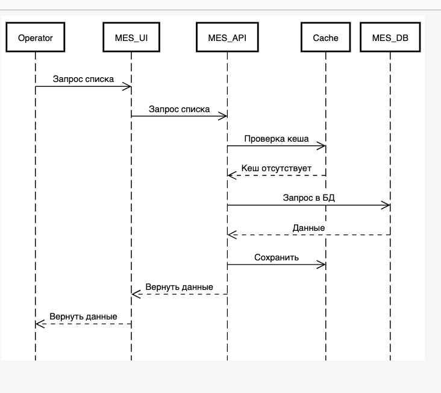
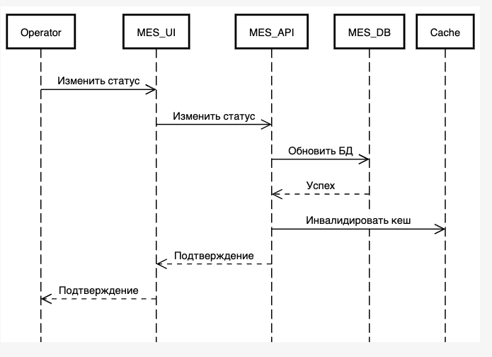

## Мотивация

Зачем внедрять кеширование:

1. Решить боль операторов с долгой загрузкой первой страницы
2. Потеря клиентов из-за проблем с производительностью
3. Долгий расчет стоимости заказа
4. Постоянный рост нагрузки на систему

Чем поможет кеширование:

1. Снизить нагрузку на API + БД
2. Ускорить открытие страницы для операторво
3. Уменьшить время получения часто запрашиваемых данных 
4. Оптимизация повторных операций
5. Повысить масштабируемость системы

Элементы системы куда внедрить кеширование:
1. Список заказов для дашборда MES
2. Отдельные заказы по ID
3. Частичную информацию о заказах
4. Статусы заказов (кешируем отдельно так как часто меняются)
5. Редко меняющиеся тяжелые операции
6. 3D-модели после первоначальной обработки

## Предлагаемое решение

Выбран серверный тип кеширования так как:

1. Основные проблемы на стороне сервера, клиентское кеширование не решит проблемы с нагрузкой на БД
2. Проще работать с инвалидацией 
3. Клиентское кеширование работает только на одном устройстве 

### Паттерн кеширования

Был выбран Cache-Aside так как:

1. Список заказов и детали заказа гораздо чаще читаются чем обновляеются
2. Простота реализации и внедрения
3. Refresh-Ahead есть риск неконсистентности данных и чтению из базы, сложнее в реализации, нужна качественная система мониторинга, чего пока нет
4. Write-Through сложнее в реализации, больше подходит для случаев когда записи больше чем чтения, клиент не получит ответа, пока база не обновится

## Предлагаемое решение

Чтение списка заказов: 

[diagram_5.1.txt](diagram_5.1.txt)

Изменение статуса заказа:

[diagram_5.2.txt](diagram_5.2.txt)

### Стратегия инвалидации кеша

| Программная	                  | По ключу	                                                                                                        | TTL                                         | 
|-------------------------------|------------------------------------------------------------------------------------------------------------------|---------------------------------------------|
| Избыточно для текущей системы | Хорошо подходит к ситуации когда только некоторые данные нуждаются в обновлении, низкий шанс показать устаревшее | Простота, повышенный риск устарвеших данных |

Выбрана гибридная стратегия:

1. TTL — для большинства запросов – для расчета стоимости (1 день), для списков заказов (TTL = 1 минута) и для иных редко изменяемых данных
2. По событию –  при изменении статуса заказа, при назначении оператора и для других критичных к изменениям данным
